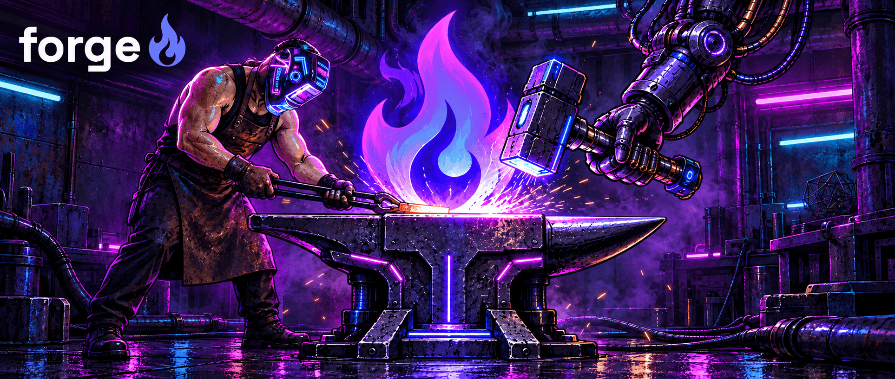

# Forge

[](https://github.com/fabioalencar/forgedesign/actions/workflows/ci.yml)

**Forge is the design record for AI-built prototypes.** It is not the build tool — the
building happens in your own coding agent. Forge owns what that work leaves behind: the
decisions, the tasks, the stakeholder feedback, and the frozen versions people were
actually shown.



This repository is the open half, Apache-2.0. It is also **its own first user**: the
`design/` directory here is a Design Record in the format these packages implement, and CI
runs `forge doctor` against it on every push.

## What's in here

| | |
| --- | --- |
| [`packages/format`](packages/format) | `@forgedesign/format` — the parser and serialiser for the record. Every consumer reads a record through this, so there is one grammar rather than one per tool. |
| [`packages/cli`](packages/cli) | `@forgedesign/cli` — the `forge` binary. |
| [`packages/scenarios`](packages/scenarios) | `@forgedesign/scenarios` — the browser runtime a prototype imports so a reviewer can be shown the app as a particular role, with particular data, from a URL. Zero dependencies. |
| [`skills/`](skills) | The agent skills. |
| [`spec/format.md`](spec/format.md) | The format itself. |

## Running it

```sh
npm install -g @forgedesign/cli
forge --help
```

Node 20 or later. The command is `forge`; if Atlassian's `@forge/cli` is installed too, the
two binaries share that name, so whichever was installed last answers.

Point it at a project — including one that already has code:

```sh
forge init ../my-prototype
forge skills install --home   # the agent skills, for Claude Code and Codex, in every project
```

That writes a `design/` bundle and a `forge.json`. `forge doctor` then checks the record
against the format's rules: unique ids, references that resolve, valid statuses, and
accepted decisions that have not been quietly edited.

To work on the packages themselves, build from a clone:

```sh
pnpm install
pnpm -r build
node packages/cli/dist/index.js --help
```

## The idea

A record is **markdown with frontmatter, in git**. Not a database, not a hosted document —
files your agent can read and write, and `git diff` can show you.

```
design/
  index.md          the bundle index (generated)
  brief.md          what this is and who it's for
  todos.md          the task ledger
  decisions/        one file per decision, immutable once accepted
  feedback/         one file per piece of stakeholder feedback
  questions/        open questions, deliberately unanswered
```

The pattern throughout is **skills talk, the CLI writes**. Judgment happens in your agent
session; a `forge` command is what actually touches the record. That is why ids and statuses
stay consistent without anyone remembering to make them so.

## What is not here

Publishing a frozen version to a URL a stakeholder can open, the PIN gate in front of it,
and the comment service behind it are a separate commercial service,
[Forge Cloud](https://useforge.design). **It is a closed beta for now, with invited accounts
only and no open sign-up.** Its commands (`forge login`, `forge publish`) are in the CLI and
listed apart in `forge --help`; nothing else in this repository needs them.

The line is drawn at **serving, not capability**. Everything that produces a record is here
and is Apache-2.0, and the whole loop runs without the service: a freeze is a portable
directory of static files you can host anywhere, and stakeholder feedback comes back into
the record from a Figma file's comments or a repository's issues (`forge comments import`)
as well as from a hosted review. What you would be reimplementing is a server, not a
format.

## Contributing

Read [CONTRIBUTING.md](CONTRIBUTING.md) first — this repository has rules that CI enforces,
and a change that ignores them fails before a human reads it. The short version: open an
issue before writing code, every change belongs to a task, and non-obvious choices get a
decision record.

## Licence

Apache-2.0. See [LICENSE](LICENSE).
